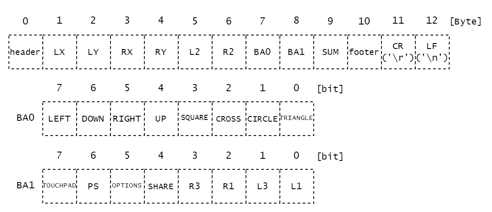
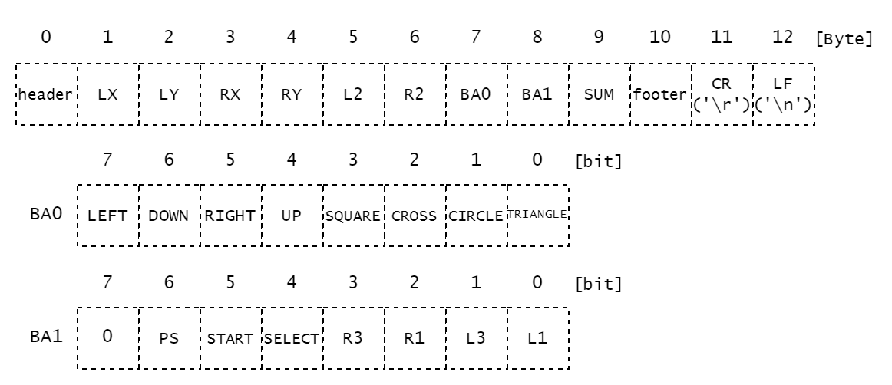
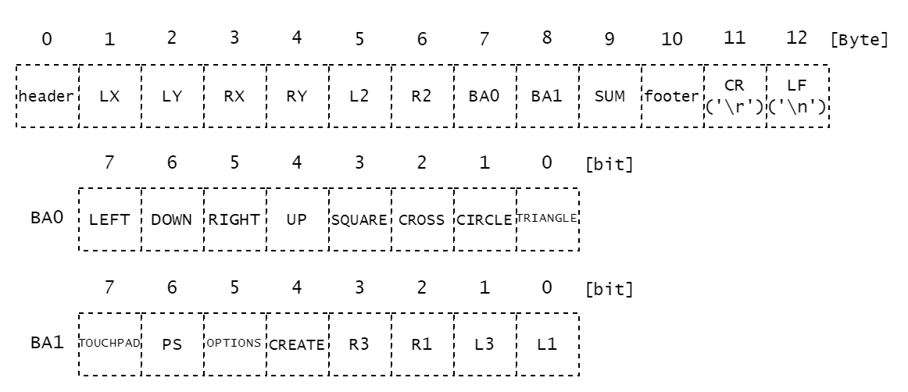

# コントローラーのデータ

## 通信モジュール

双葉電子の`FEP02`を使用している。  
> [FEP-02](https://www.futaba.co.jp/product/industry/industry_module/fep02)  

`920MHz`帯の無線モジュールであり、`UART`(シリアル通信)でデータの送信を行っている。`Baudrate`は`38400bps`になっているものが多い。  

## 送信側

使用機器  

- `Arduino Uno R3`
- `USB Host Shield 2.0`
- `FEP`
- コントローラー  
  `DUALSHOCK4`などが多い

以下の図のように接続する。  

  

## 受信側

使用機器  

- マイコン
  `STM32F446RET6`や`STM32F303K8T6`などが多い
- `FEP`

以下の図のように接続する。  

  

## 送受信するデータ

`DUALSHOCK4`の場合  

  

`DUALSHOCK3`の場合  

  

`DUALSENSE`の場合  

  

データ型はすべて`uint8_t`。合計13Byte。  

`header` : `0xaf`  
`SUM` : データ確認用SUM `1~8Byte`の合計値  
`footer` : `0xed`  
