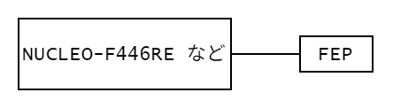

# コントローラー受信側(Receive)  

## 通信モジュール

[送信側](./txfep.md/#通信モジュール)と同じ。ペアになっているものを使用する。

## 使用機器・接続方法

- マイコン
  `STM32F446RET6`や`STM32F303K8T6`などが多い
- `FEP`

以下の図のように接続する。  

  

## 受信データ

[送信されたデータ](./txfep.md/#送信データ)をそのまま受信する。  
