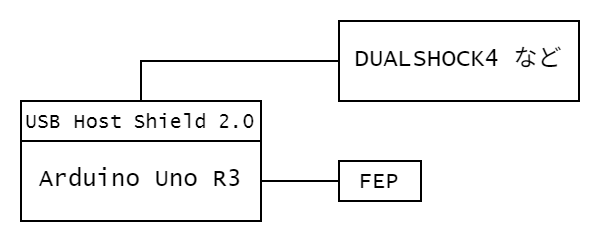

# コントローラー送信側(Transmit)  

## 通信モジュール

双葉電子の`FEP02`を使用している。  
> [FEP-02](https://www.futaba.co.jp/product/industry/industry_module/fep02)  

`920MHz`帯の無線モジュールであり、`UART`でデータの送信を行っている。`Baudrate`は`38400bps`になっているものが多い。  

## 使用機器・接続方法

- `Arduino Uno R3`
- `USB Host Shield 2.0`
- `FEP`
- コントローラー  
  `DUALSHOCK4`などが多い

以下の図のように接続する。  

## 送信データ

データ型はすべて`uint8_t`。つまり合計`13Byte`のデータが1セットになっている。

0. `0xaf` : ヘッダー符号
1. `LX`
2. `LY`
3. `RX`
4. `RY`
5. `L2`
6. `R2`
7. `BA0` : ディジタルボタンの値8個分のセット0
   0. `TRIANGLE`
   1. `CIRCLE`
   2. `CROSS`
   3. `SQUARE`
   4. `UP`
   5. `RIGHT`
   6. `DOWN`
   7. `LEFT`
8. `BA1` : ディジタルボタンの値8個分のセット1
   0. `L1`
   1. `L3`
   2. `R1`
   3. `R3`
   4. `SHARE(DUALSHOCK4)` or `SELECT(DUALSHOCK3)` or `CREATE(DUALSENSE)`
   5. `OPTIONS(DUALSHOCK4 or DUALSENSE)` or `START(DUALSHOCK3)`
   6. `PS`
   7. `TOUCHPAD(DUALSHOCK4 or DUALSENSE)` or `N/A(DUALSHOCK3)`
9. `SUM` : データ確認用SUM `1~8Byte`の合計値
10. `0xed` : フッター符号
11. `0x0d` : `CR(\r)`
12. `0x0a` : `LF(\n)`
