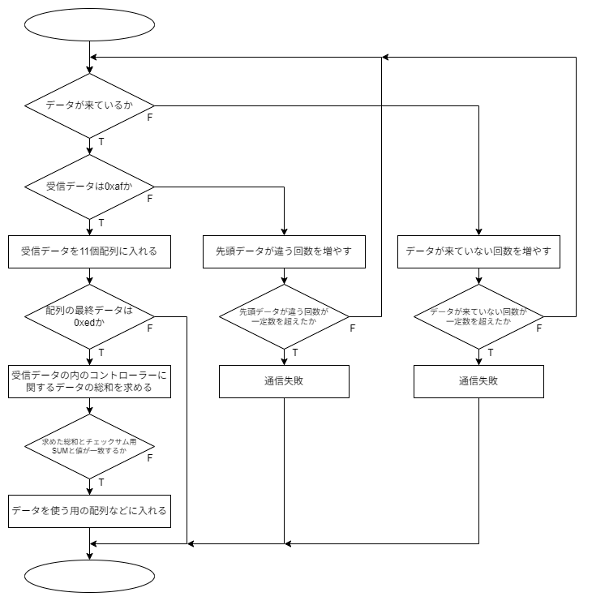

# コントローラーで送受信するデータ

## 通信モジュール  

現在(2025/03/12)は、双葉電子の`FEP02TJ`を主に使用している。([FEP-02](https://www.futaba.co.jp/product/industry/industry_module/fep02))  
周波数帯は`920MHz`帯で無線モジュール。`UART`を用いた通信が可能。部のほとんどのものがボードレート`38400[Symbol/sec(bit/s)]`に設定されている。  

## RXとTX  

マイコンボードのピン配置などで`UART1_RX`や`UART2_TX`などと書いてあるものを見たことがあると思う。`RX`は`Receive`の略で`TX`は`Transmit`の略でそれぞれ`受信する`、`送信する`という意味だ。無線モジュールを使用しない場合の多くは`Arduino`などの送信側の`TX`と`F446RE`などの受信側の`RX`をつなぎ送受信する。  

## 送信側  

主に`Arduino Uno Rev3`に`USB Host Shield`を接続し、`USB Host Shield`に`DUALSHOCK4`などのコントローラーを接続し、`Arduino`でコントローラーのデータを読み取りそれをシリアル通信を用いて受信側に送る。受信データは以下の表の内容になって全てで`11byte`ある。  

|byte数|data|説明|
|:---:|:---:|:---:|
| 0byte|0ｈxaf|先頭データを表す|
| 1byte|unsigned char|LアナログスティックのX座標|
| 2byte|unsigned char|LアナログスティックのY座標|
| 3byte|unsigned char|RアナログスティックのX座標|
| 4byte|unsigned char|RアナログスティックのY座標|
| 5byte|unsigned char|L2アナログボタン|
| 6byte|unsigned char|R2アナログボタン|
| 7byte|unsigned char|ディジタルボタンセット1|
| 8byte|unsigned char|ディジタルボタンセット2|
| 9byte|unsigned char|チェックサム用SUM|
|10byte|0xed|終端データを表す|  

### ディジタルボタンセット1  

|bit数|data|説明|
|:---:|:---:|:---:|
|0bit|0/1|TRIANGLE|
|1bit|0/1|CIRCLE|
|2bit|0/1|CROSS|
|3bit|0/1|SQUARE|
|4bit|0/1|UP|
|5bit|0/1|RIGHT|
|6bit|0/1|DOWN|
|7bit|0/1|LEFT|  

### ディジタルボタンセット2  

|bit数|data|説明|
|:---:|:---:|:---:|
|0bit|0/1|L1|
|1bit|0/1|L3|
|2bit|0/1|R1|
|3bit|0/1|R3|
|4bit|0/1|CREATE / SHARE / SELECT|
|5bit|0/1|OPTIONS / START|
|6bit|0/1|PS|
|7bit|0/1|TOUCHPAD / N/A|  

`N/A`:なし  
`SHARE`,`OPTIONS`,`TOUCHPAD`は`DUALSHOCK4`の場合、`SELECT`,`START`,`N/A`は`DUALSHOCK3`の場合。  
ボタンセットはボタンが押されている時に各bitが`1`になるようにしている。  

|bit数|16進数表記|2進数表記|
|:---:|:---:|:---:|
|0bit|0x01|0000 0001|
|1bit|0x02|0000 0010|
|2bit|0x04|0000 0100|
|3bit|0x08|0000 1000|
|4bit|0x10|0001 0000|
|5bit|0x20|0010 0000|
|6bit|0x40|0100 0000|
|7bit|0x80|1000 0000|  

### チェックサム用SUM  

SUM = `(LアナログスティックのX座標)` + `(LアナログスティックのY座標)` + `(RアナログスティックのX座標)` + `(RアナログスティックのY座標)` + `(L2アナログボタン)` + `(R2アナログボタン)` + `(ディジタルボタンセット1)` + `(ディジタルボタンセット2)`  

## 受信側  

`NUCLEO-F446RE`などで`FEP`を通して`Arduino`から送られてきたデータはある処理をされて使用するデータに格納される。その処理はざっくり言うと以下の図のような処理になる。  
  
各環境や言語によって使われる関数などは違うがだいたいはこのような感じの処理をしている。  
各環境の受信側ライブラリ(現在あるもの)  

* [Mbed(Keil Studio)](https://os.mbed.com/users/yabumi823/code/SerialCtrl/)  
* [STM32CubeIDE(F446RE)](https://github.com/s2301089/development-F446RE/tree/main/lib/UART_Arduino)  

### ボタンセットの値の読み取り方  

送信側ではボタンが押されたらbit論理和代入をしている。例えば`0x10`と`0x04`のボタンが押されている場合は`0001 0000 + 0000 0100 = 0001 0100`になる。そうすると送信側では、`0x14`が送信される。受信側では各ボタンの判定を行えば良く、ボタンが押されているかどうかは論理積を用いる。`0x10`の場合は`0x14 ・ 0x10 = 0x10`になる。このようにしてボタンの状態を読み取る。  
