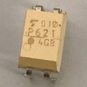
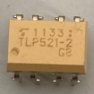
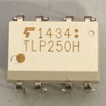

# モーターのPWM制御  

## PWMとは  

`PWM`とは、`Pulse Width Modulation`の略で`パルス幅変調`という。一定周期の中で出力が`HIGH`の長さと`LOW`の長さ比(デューティ比)で出力が決まる。  
> 出力が`5V`でデューティ比が`25%`であれば、出力は`1.25V`になる。出力電圧は以下の式で求められる。  
> `(出力電圧) = (最大電圧) × (デューティ比)`  
> そのため、デューティ比が小さすぎると素子によってはデューティ比`0％`とあまり変わらない結果が得られるものもある。各素子の最低電圧などを確認すること。  

## モーターを回す  

回路的には以下のようになっている。  
  
モタドラICの動作電圧が`12V`でマイコンからの信号の電圧が`5V`か`3.3V`なので電圧を上げる必要がある。それをフォトカプラ基板で信号のやり取りを行っている。また、`PWM`の周期を`83[μs]`に設定する。これはモタドラICの周波数が`12[kHz]`あたりがいいらしいからだ(モタドラIC`HIP4081AIPZ`)。  

## フォトカプラによる動作の違い  

| フォトカプラ | 部品 | 用途 | 向き |  
|:-------:|:------:|:------:|:-----:|  
| ['TLP621'](https://jp.rs-online.com/web/p/optocouplers/1611038?gb=a) |  | ディジタルの変換 | 左下にある◯がマイコン側 |  
| ['TLP521-2'](https://jp.rs-online.com/web/p/optocouplers/1718031?cm_mmc=JP-PLA-DS3A-_-google-_-PLA_JP_JP_ePmax_Prio1-_--_-&matchtype=&&campaignid=20858944244&gad_source=1&gclid=CjwKCAiArKW-BhAzEiwAZhWsIC59PvjUU27b9lFqq5lPOYafc83XY63O_NRmTJ4k13gT-4t-ofMuexoCSNoQAvD_BwE&gclsrc=aw.ds) |  | ディジタルの変換×2 | 左下にある◯がマイコン側または、角が削れている方がマイコン側 |  
| ['PS9513'](https://jp.rs-online.com/web/p/optocouplers/2347111?srsltid=AfmBOop1mbTNh_2S3L3LVPv-URRDD3y03iuBuspMm1w5xkRcWY2EgoUm) |  | PWMの変換 | 左下にある◯がマイコン側 |  
| ['TLP250H'](https://jp.rs-online.com/web/p/optocouplers/8851279?srsltid=AfmBOoqXYwz-_Yaf1EzdvjIdm6IBj3ft_dYQmsY4QKocpl6aMEDGDWGd) |  | PWMの変換 | 左下にある◯がマイコン側または、角が削れている方がマイコン側 |  

**注意点**  

* `TLP521-2`はPWMの変換と同じような大きさだが内部の配線では`TLP621`が2個あるような配置になっている。PWMの変換には使用できないので注意。  
* `PS9513`を標準とすると`TLP250H`は出力が反転している。例えば、入力に`0`が入っている場合`PS9513`では出力が`0`だが、`TLP250H`では`255`が出力される。使用するフォトカプラに合わせてコードを書き換える必要がある。  

## 左回りと右回り(正転と反転)  

| PWM側フォトカプラ | Digi | LOWの時のデューティ比 | HIGHの時のデューティ比 | 回転方向 | 出力波形部分 |
|:----------------:|:----:|:-------------------:|:--------------------:|:--------:|:-----------:|
| PS9513 | 0 | 0 | 255 | 左回り | ① |
| PS9513 | 1 | 255 | 0 | 右回り | ② |
| TLP250H | 0 | 255 | 0 | 左回り | ② |
| TLP250H | 1 | 0 | 255 | 右回り | ① |  

`出力波形`  
  

### 参考  

* [Arduino（アルディーノ）電子工作の基本④ LEDの明るさを調節する](https://deviceplus.jp/arduino/arduino_f04/)  
* [STM32 HALを使ってPWM出力してみる](https://moons.link/post-632/)  
