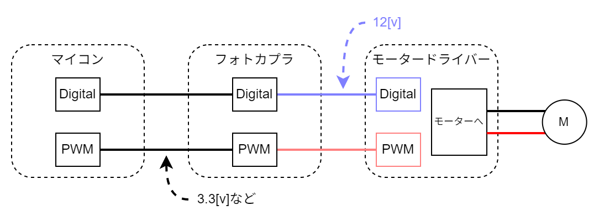
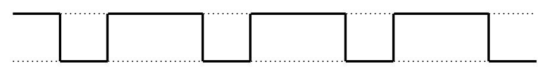
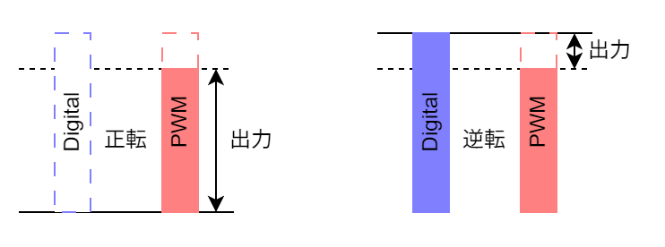

# DCモーターの制御  

## 制御用回路

回路的には以下のようになっています。  
  
モタドラICの動作電圧が`12V`でマイコンからの信号の電圧が`5V`か`3.3V`なので電圧を上げる必要があります。それをフォトカプラで信号のやり取りを行っています。  
また、`PWM`の周期を`83[μs]`に設定します(宗派)。フォトカプラが変換に対応する周波数によって決まっています。  

## PWM  

```admonish info "PWMとは"
`Pulse Width Modulation`の略で`パルス幅変調`といいます。  
一定周期の中で出力が`HIGH`の時間と`LOW`の時間の比(デューティー比)で中間の電圧を擬似的に表現します。  

PWMの出力波形は以下の図のようなものです。  
  
```

```admonish example "出力の例"
GPIOピンの出力が`5V`でデューティー比が`25%`であれば、出力は`1.25V`になります。出力電圧は以下の式で求められます。  
$$ 出力電圧 = {最大電圧} \times {デューティー比} $$  
デューティー比が小さいと素子によってはデューティー比`0％`とあまり変わらない結果が得られるものもあります。**各素子の動作電圧**などを確認してください。  
```

## 出力の決定

モーターへの出力は`Digital`と`PWM`の2つで決まり、`Digital`と`PWM`の差が出力になります。図示すると以下のようになります。  

  

`Digital`の値がモーターの回転方向に対応し、`PWM`のデューティー比がモーターの回転速度(印加電圧)と対応します。  

---

```admonish quote "参考"  
- [Arduino（アルディーノ）電子工作の基本④ LEDの明るさを調節する](https://deviceplus.jp/arduino/arduino_f04/)  
- [STM32 HALを使ってPWM出力してみる](https://moons.link/post-632/)  
```
