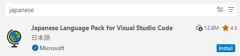
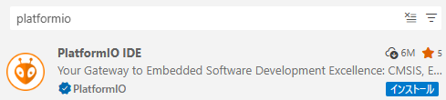

# 環境構築

```admonish info "PlatformIO IDEとは"
`vscode`(`Visual Studio Code`)の拡張機能の一つです。マイコンへのプログラム作成やプログラムのビルド、マイコンへの書き込みなど、基本的なことが一つでできるようになる拡張機能です。  
さまざまなフレームワーク(環境)に対応した拡張機能で、いろいろなマイコンへのプログラムをこの拡張機能だけで対応できます。  
OSにあまり依存しないため、誰でも気軽に作成することができます。
```

## Visual Studio Codeの導入

導入済みの人は[PlatformIO IDEの導入](#platformio-ideの導入)

- `vscode`をダウンロードします。
  [Visual Studio Code](https://code.visualstudio.com/)  
  `Download for Windows`から`Windows`版のインストーラーをダウンロードしてください。
- ダウンロードしたインストーラー`VSCodeUserSetup-x64-x.x.x.exe`をクリックし、インストーラーを起動します。
  同意し、基本的に`次へ`の選択で大丈夫です。
  デスクトップのショートカット、あるいは、スタートから起動してください。  
- インストーラーの実行を終えたら`vscode`を起動します。
  デスクトップのショートカット、あるいは、スタートから起動してください。  
- 初回起動時はテーマなどの選択画面が表示されると思います。
  個人的にはライト(Visual Studio Light)がおすすめです。

```admonish important "学内LANでダウンロードなどをする場合"
パソコンのプロキシ設定に加えて`vscode`のプロキシ設定も必要です。  
- 左下の歯車マークから設定を開きます。(`Ctrl`+`,`)  
    
- 検索欄に`proxy`と入力し、次の項目を探します。  
    
  `http://プロキシサーバー:ポート番号/`の形で入力します。  
```

- まずは言語を日本語に変更します。
- 左のバーのブロックのマークから拡張機能を開きます。(`Ctrl`+`Shift`+`x`)  
  
- マーケットプレイスの検索欄に`japanese`と入力し、`Japanese Language Pack for Visual Studio Code`を探します。  
  
- `install`を押し、インストールを行い、通知から`vscode`を再起動します。  
  

## PlatformIO IDEの導入

- `PlatformIO IDE`をインストールします。
- 拡張機能のタブから検索欄に`platformio`と入力し、`PlatformIO IDE`を探します。  
  
- `インストール`を押し、インストールを行います。  

````admonish warning "Pythonの導入"
`PlatformIO`のインストール中に次のようなメッセージが通知される場合があります。  
```log
PlatformIO: Can not find working Python 3.6+ Interpreter. 
Please install the latest Python 3 and restart VSCode
```

この通知はパソコン内に`Python 3.6`以上のバージョンの`Python`が見当たりませんと言われています。  
`Python`をインストールしていない人は通知のボタンから`Install Python`を押してダウンロードサイトからWindows用をダウンロードしましょう。[Python Releases for Windows](https://www.python.org/downloads/windows/)  
すでに`Python`をインストールしている場合は`I have Python`を押して`python.exe`の`PATH`を教えてあげます。  

> `PlatformIO`は`Python 3.11`以下でのみ動作する場合があります。そのようなエラーメッセージが表示された場合は、ダウンロードサイトの下の方に過去のバージョンリリースがあるのでそこからインストーラーをダウンロードします。  
>   

- ダウンロードしたインストーラーを実行します。
- `Add Python.exe to PATH`にチェックを入れます。
- `Install Now`を押し、インストールします。

`Setup was Successful`が表示されたらインストーラーは閉じて大丈夫です。  
`Disable path length limit`という項目が表示される場合があります。これは、パスの長さの上限についての項目です。選択する、しないはそれぞれで決めてください。行わなくても問題はないと思います(自分は選択しました)。  
インストーラーを終了したら、`vscode`を一度再起動し、他のインストールが終了するのを待ちます。
````

---

```admonish quote "参考"

- [ArduinoをVSCodeで開発する【PlatformIO】](https://tech.nri-net.com/entry/arduino_with_vscode)  
- [Visual Studio Code に Proxy を設定する方法](https://qiita.com/cointoss1973/items/b3c84daeed90fd183501)  
- [Windows版Pythonのインストール](https://www.python.jp/install/windows/install.html)  

```
