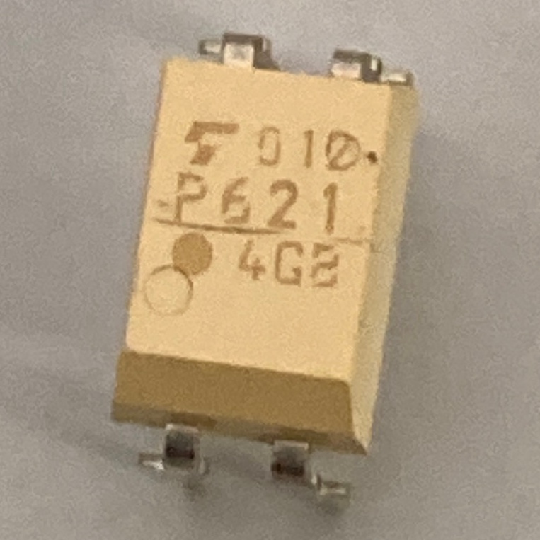
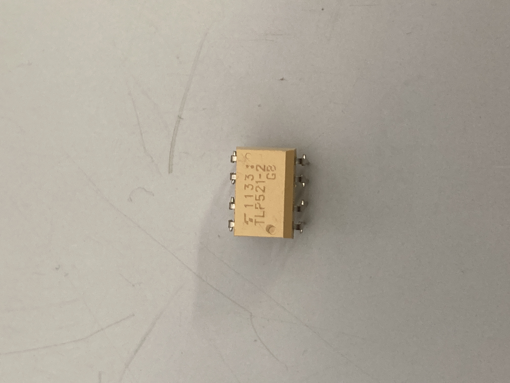
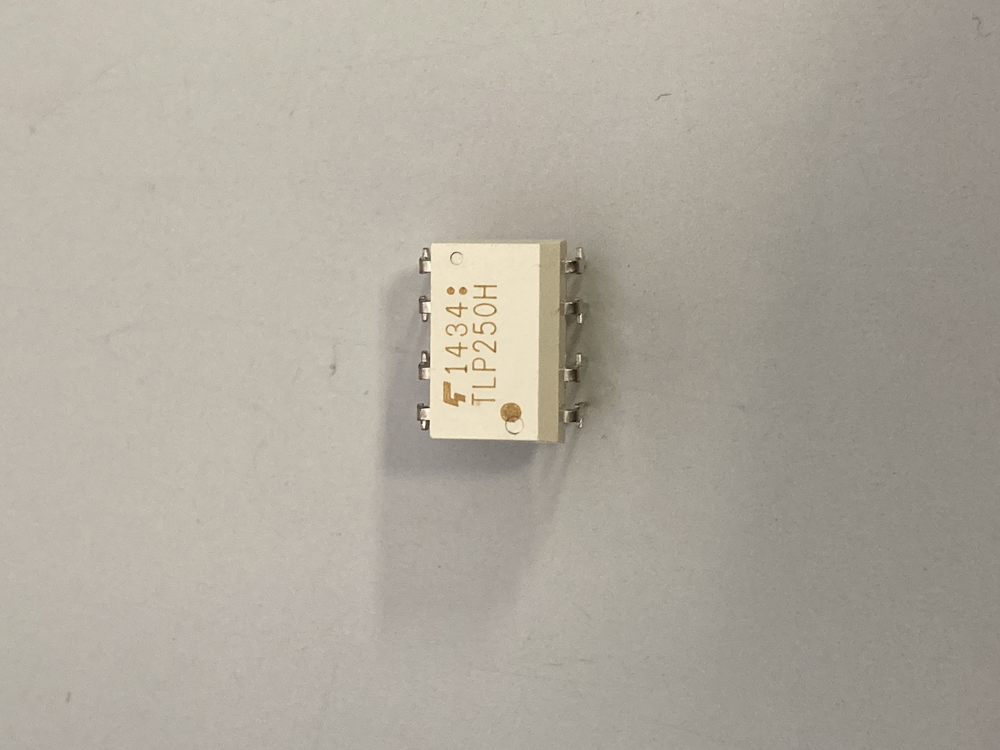

# モーターのPWM制御

### フォトカプラによる動作の違い  

|------|------|-----|  
| フォトカプラ | 用途 | 画像 |  
| [TLP621](https://jp.rs-online.com/web/p/optocouplers/1611038?gb=a) | ディジタルの変換 |  |  
| [TLP521-2](https://jp.rs-online.com/web/p/optocouplers/1718031?cm_mmc=JP-PLA-DS3A-_-google-_-PLA_JP_JP_ePmax_Prio1-_--_-&matchtype=&&campaignid=20858944244&gad_source=1&gclid=CjwKCAiArKW-BhAzEiwAZhWsIC59PvjUU27b9lFqq5lPOYafc83XY63O_NRmTJ4k13gT-4t-ofMuexoCSNoQAvD_BwE&gclsrc=aw.ds) | ディジタルの変換*2 |  |  
| [PS9513](https://jp.rs-online.com/web/p/optocouplers/2347111?srsltid=AfmBOop1mbTNh_2S3L3LVPv-URRDD3y03iuBuspMm1w5xkRcWY2EgoUm) | PWMの変換 |  |  
| [TLP250H](https://jp.rs-online.com/web/p/optocouplers/8851279?srsltid=AfmBOoqXYwz-_Yaf1EzdvjIdm6IBj3ft_dYQmsY4QKocpl6aMEDGDWGd) | PWMの変換 |  |  