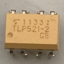
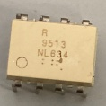

# モーターのPWM制御

### フォトカプラによる動作の違い  

| フォトカプラ | 部品 | 用途 | 向き |
|:------:|:------:|:-----:|
| [TLP621](https://jp.rs-online.com/web/p/optocouplers/1611038?gb=a) |  | ディジタルの変換 | 左下にある◯がマイコン側 |
| [TLP521-2](https://jp.rs-online.com/web/p/optocouplers/1718031?cm_mmc=JP-PLA-DS3A-_-google-_-PLA_JP_JP_ePmax_Prio1-_--_-&matchtype=&&campaignid=20858944244&gad_source=1&gclid=CjwKCAiArKW-BhAzEiwAZhWsIC59PvjUU27b9lFqq5lPOYafc83XY63O_NRmTJ4k13gT-4t-ofMuexoCSNoQAvD_BwE&gclsrc=aw.ds) |  | ディジタルの変換*2 | 左下にある◯がマイコン側または、角が削れている方がマイコン側 |
| [PS9513](https://jp.rs-online.com/web/p/optocouplers/2347111?srsltid=AfmBOop1mbTNh_2S3L3LVPv-URRDD3y03iuBuspMm1w5xkRcWY2EgoUm) |  | PWMの変換 | 左下にある◯がマイコン側 |
| [TLP250H](https://jp.rs-online.com/web/p/optocouplers/8851279?srsltid=AfmBOoqXYwz-_Yaf1EzdvjIdm6IBj3ft_dYQmsY4QKocpl6aMEDGDWGd) |  | PWMの変換 | 左下にある◯がマイコン側または、角が削れている方がマイコン側 |  

**注意点**  
* `TLP521-2`はPWMの変換と同じような大きさだが内部の配線では`TLP621`が2個あるような配置になっている。