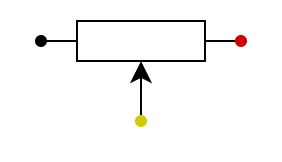

# アナログ入力

## `AnalogIn`

アナログ入力をする場合は、`AnalogIn`クラスを使用します。  

### コンストラクタ

コンストラクタは`AnalogIn(PinName pin, float vref = MBED_CONF_TARGET_DEFAULT_ADC_VREF)`で定義されています。  

- `pin`
  - 使用するピンを指定します。
  - アナログ入力には`ADC`を使用するため、`ADC`に対応しているピンを指定する必要があります。
- `vref`
  - 基準電圧を指定します。
  - よく分かりませんでした。
  - 指定しない場合は初期値として`MBED_CONF_TARGET_DEFAULT_ADC_VREF`が指定されます。

```cpp : vref初期値
AnalogIn var_r1(PA_0);
```

`var_r1`というインスタンスを宣言しています。ピンは`PA_0`を指定しています。  

### `float read(void)`

ピンの入力電圧を読み取り、`0.0f(0%)`~`1.0f(100%)`の値を返します。  

```cpp : 設定値の取得
float pin_value = var_r1.read();
```

### `unsigned short read_u16(void)`

ピンの入力電圧を読み取り、`0x0000(0%)`~`0xffff(100%)`の値を返します。  
入力電圧を`16bit`に正規化して返します。  

```cpp : 設定値の取得
uint16_t pin_value = var_r1.read_u16();
```

## サンプルプログラム

````admonish example "LEDの明るさ制御"
`PA5`を`PA0`の入力値を出力に設定するプログラムです。  
`NUCLEO-F446RE`で動作確認しました。評価ボード上の`LD2`が外部の半固定抵抗の値によって明るさが変化します。次の回路で動作確認を行いました。  

  

```cpp : main.cpp
#include "mbed.h"

using namespace std;
using namespace mbed;

int main(void){
    AnalogIn var_r1(PA_0);
    PwmOut led2(PA_5);
    led2.period_ms(1);

    while(1){
        led2.write(var_r1.read());
    }

    return 0;
}
```

半固定抵抗のつまみを左から右に回すと`LED`が明るくなり、右から左に回すと`LED`が暗くなります。  

半固定抵抗はこのような記号で表されます。

  

この状態では`3.3[V]-R1-R2-GND`の直列回路になります。分圧されるので中間の電圧が入力電圧となり、中途半端な明るさになります。  
左に回しきったときは次の状態になります。  

  

この状態では`3.3[V]-R-GND`の回路になり、入力電圧が\\(\mathrm{0[V]}\\)になるので、消灯(`0%`)になります。  
右に回しきったときは次の状態になります。  

  

この状態では、入力電圧が\\(\mathrm{3.3[V]}\\)になるので、点灯(`100%`)になります。

````

## 他のメソッド(使用したことがない)

### `float read_voltage(void)`

### `void set_reference_voltage(float vref)`

### `float get_reference_voltage()`

---

```admonish quote "使用部品"

- [NUCLEO-F446RE](https://www.st.com/ja/evaluation-tools/nucleo-f446re.html)
- USB A to miniB ケーブル
- [ブレッドボード](https://akizukidenshi.com/catalog/g/g100315/)
- [半固定抵抗 10[kΩ]](https://akizukidenshi.com/catalog/g/g106110/)
- ジャンパ線

```

```admonish quote "参考"


```
