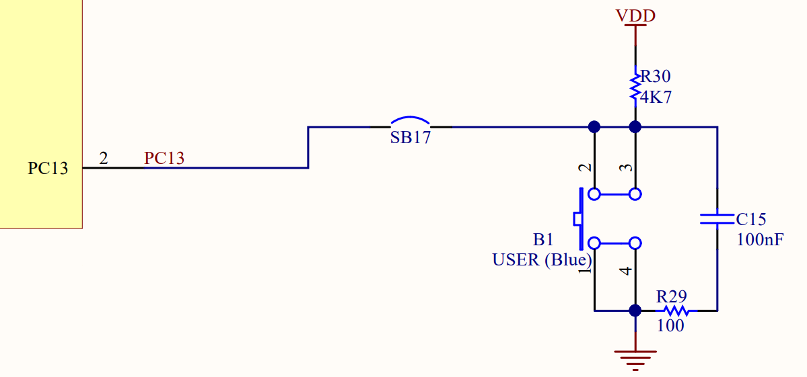

# ディジタル入力

## `DigitalIn`

ディジタル入力をする場合は`DigitalIn`クラスを使用します。  

### コンストラクタ

コンストラクタは`DigitalIn(PinName pin)`、`DigitalIn(PinName pin, PinMode mode)`で定義されています。  

- `pin`
  - 使用するピンを指定します。
- `mode`
  - ピンの初期モードを指定します。
  - `PullUp`、`PullDown`、`PullNone`、`OpenDrain`で指定できます。

```cpp : 初期モード：未定
DigitalIn button1(PC_13);
```

`button1`というインスタンスを宣言しています。ピンは`PC13`を指定しています。  

```cpp : 初期モード：プルアップ
DigitalIn button1(PC_13, PullUp);
```

### `int read(void)`

ピンの入力を読み取り、`0`、または、`1`を返します。  

```cpp : 設定値の取得
int pin_state = button1.read();
```

### `void mode(PinMode pull)`

入力ピンのモードを指定します。  

- `PullUp`
  - 内部プルアップ抵抗を使用する。
- `PullDown`
  - 内部プルダウン抵抗を使用する。
- `PullNone`
  - 内部プルアップ抵抗、内部プルダウン抵抗を使用しない。
  - 入力を不定にしない場合は、外部にプルアップ抵抗、または、プルダウン抵抗を付ける必要があります。
- `OpenDrain`
  - よく分かりません。

```cpp : ピンモード：プルダウン
button1.mode(PullDown);
```

## サンプルプログラム

````admonish example "LED点灯"
`PA5`を`PC13`の入力値を出力に設定するプログラムです。  
`NUCLEO-F446RE`で動作確認しました。評価ボード上の`LD2`が評価ボード上の`B1`(青のプッシュスイッチ)を押していると消灯し、押していないと点灯します。  

```cpp : main.cpp
#include "mbed.h"

using namespace std;
using namespace mbed;

int main(void){
    DigitalOut led2(PA_5, 0);
    DigitalIn button1(PC_13, PullNone);

    while(1){
        led2.write(button1.read());
    }

    return 0;
}
```

`LD2`が`B1`によって点灯・消灯する理由を説明します。  

**評価ボードの回路図**  

  

回路図では、`B1`は`SB17`を通り`PC13`に接続されています。評価ボードの`SB17`には\\(\mathrm{0[\Omega]}\\)の抵抗が実装されています。  
`B1`が押されていない間は、`VDD-R30-C15-R29-GND`の回路になっています。`VDD`は直流なので`C15`は開放扱いとなり、`PC13`の電位は`VDD`の\\(\mathrm{3.3[V]}\\)になります。そのため、`HIGH`になり、`LD2`が点灯します。  
`B1`が押されている間は、`VDD-R30-(0||C15-R29)-GND`の回路になっています。`C15`を開放扱いとすると、`VDD-R30-GND`の回路となり、`PC13`の電位は`GND`の\\(\mathrm{0[V]}\\)になります。そのため、`LOW`になり、`LD2`が消灯します。  
この回路では、抵抗が\\(\mathrm{4.7k[\Omega]}\\)で、`VDD`が\\(\mathrm{3.3[V]}\\)なので、電流は\\(\mathrm{約0.70[mA]}\\)となります。`PC13`は\\(\mathrm{3[mA]}\\)未満にする必要がありますが、\\(\mathrm{約0.70[mA]}\\)なので問題はありません。  

````

## 他のメソッド(使用したことがない)

### `int is_connected(void)`

---

```admonish quote "使用部品"

- [NUCLEO-F446RE](https://www.st.com/ja/evaluation-tools/nucleo-f446re.html)
- USB A to miniB ケーブル

```

```admonish quote "参考"

- [MB1136-DEFAULT-C05 Board schematic](https://www.st.com/resource/en/schematic_pack/mb1136-default-c05_schematic.pdf)
- [DS10693](https://www.st.com/resource/en/datasheet/stm32f446mc.pdf)
- [About pullnone setting of unused pin for artix-7.](https://adaptivesupport.amd.com/s/question/0D52E00006hpZk5SAE/about-pullnone-setting-of-unused-pin-for-artix7?language=en_US)

```
