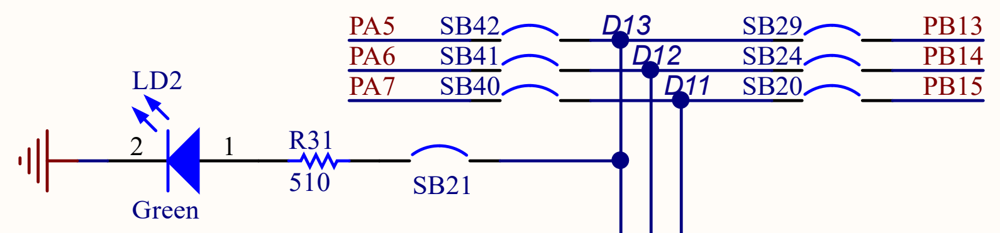

# ディジタル出力

## `DigitalOut`

ディジタル出力をする場合は`DigitalOut`クラスを使用します。  

### インスタンス

コンストラクタは`DigitalOut(PinName pin)`、`DigitalOut(PinName pin, int value)`で定義されています。  

- `pin`
  - 使用するピンを指定します。
- `value`
  - ピンの初期値を指定します。
  - `0`、`1`で指定できます。

```cpp : 初期値：未定
DigitalOut led2(PA_5);
```

`led2`というインスタンスを宣言しています。ピンは`PA5`を指定しています。  

```cpp : 初期値：1
DigitalOut led2(PA_5, 1);
```

### `void write(int value)`

ピンの出力を`0`、または、`1`に指定します。出力は論理値になります。  
`0`は`LOW`に、`1`は`HIGH`に指定します。  

```cpp : 1に設定
led2.write(1);
```

### `int read(void)`

ピンの出力設定を`0`、または、`1`を返します。  

```cpp : 設定値の取得
int pin_state = led2.read();
```

## サンプルプログラム

````admonish example "Lチカ"
`PA5`を`250ms`間隔で出力を反転させるプログラムです。  
`NUCLEO-F446RE`で動作確認しました。評価ボード上の`LD2`が`250ms`間隔で点滅します。  

```cpp : main.cpp
#include "mbed.h"

using namespace std;
using namespace mbed;

int main(void){
    DigitalOut led2(PA_5, 0);
    chrono::milliseconds blinking_interval = 250ms;

    while(1){
        led2.write(!led2.read());
        ThisThread::sleep_for(blinking_interval);
    }

    return 0;
}
```

`LD2`が点滅する理由を説明します。  

**評価ボードの回路図**  

  

回路図では、`LD2`は`SB21`、`SB42`を通り`PA5`に接続されています。評価ボードの`SB21`と`SB42`には\\(\mathrm{0[\Omega]}\\)の抵抗が実装されています。`LED`が点灯する電流は\\(\mathrm{約5[mA]～20[mA]}\\)と言われています。  
この回路では、抵抗が\\(\mathrm{510[\Omega]}\\)で、`F446RE`の`GPIO`電圧が\\(\mathrm{3.3[V]}\\)なので、電流は\\(\mathrm{約6.47[mA]}\\)となり、`LED`が点灯します。  
`STM32F446RET6`の`GPIO`ピンの電流は\\(\mathrm{25[mA]}\\)(最大定格)未満にする必要がありますが、\\(\mathrm{約6.47[mA]}\\)なので問題はありません。  

````

---

```admonish quote "使用部品"

- [NUCLEO-F446RE](https://www.st.com/ja/evaluation-tools/nucleo-f446re.html)
- USB A to miniB ケーブル

```

```admonish quote "参考"

- [MB1136-DEFAULT-C05 Board schematic](https://www.st.com/resource/en/schematic_pack/mb1136-default-c05_schematic.pdf)
- [DS10693](https://www.st.com/resource/en/datasheet/stm32f446mc.pdf)

```
